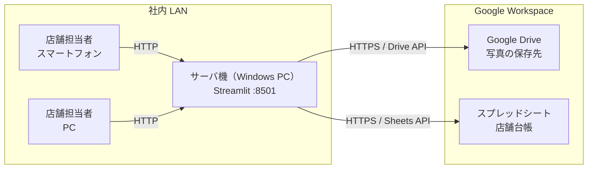
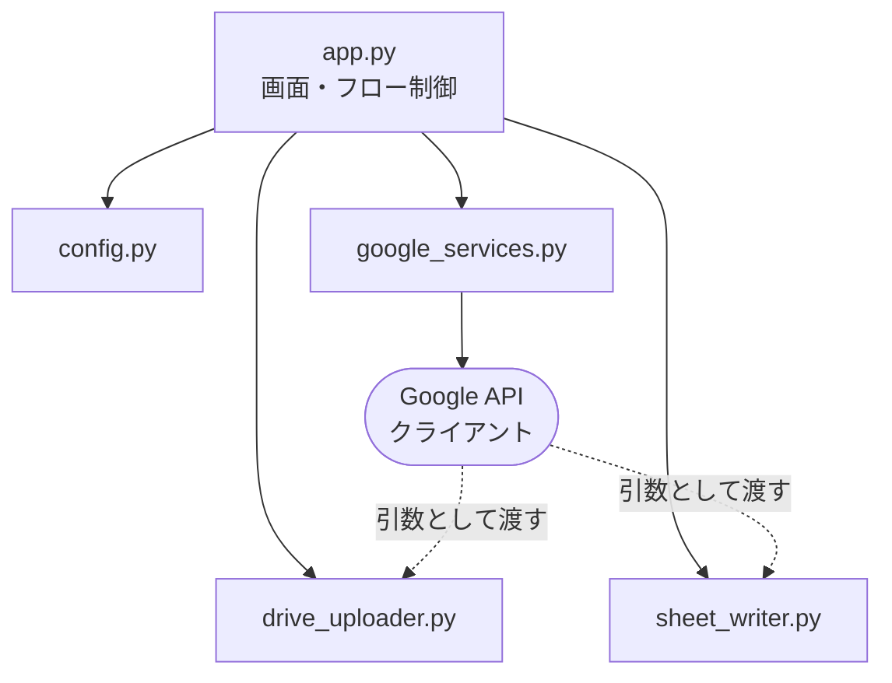
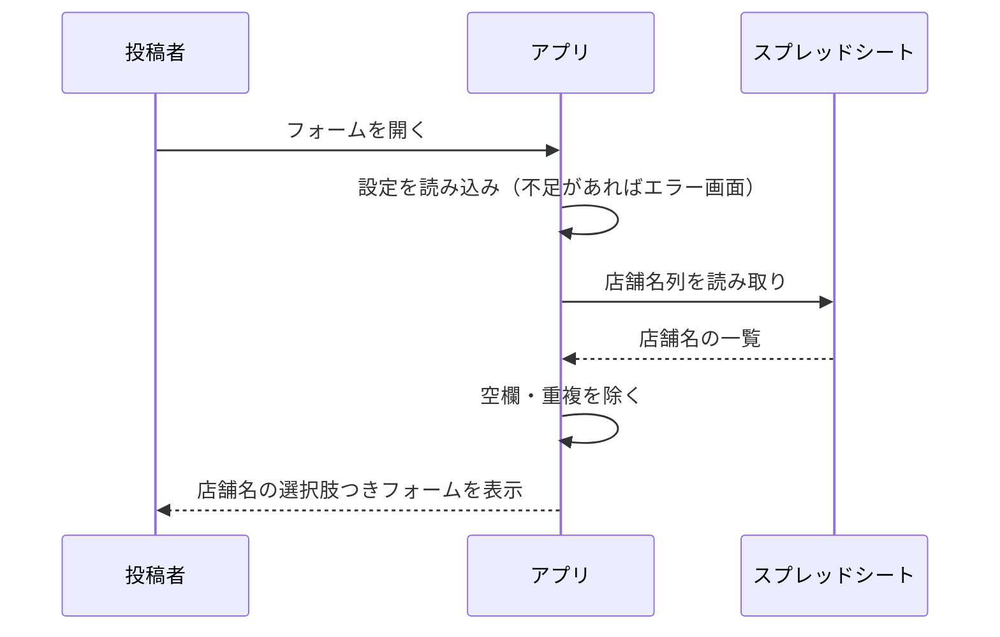
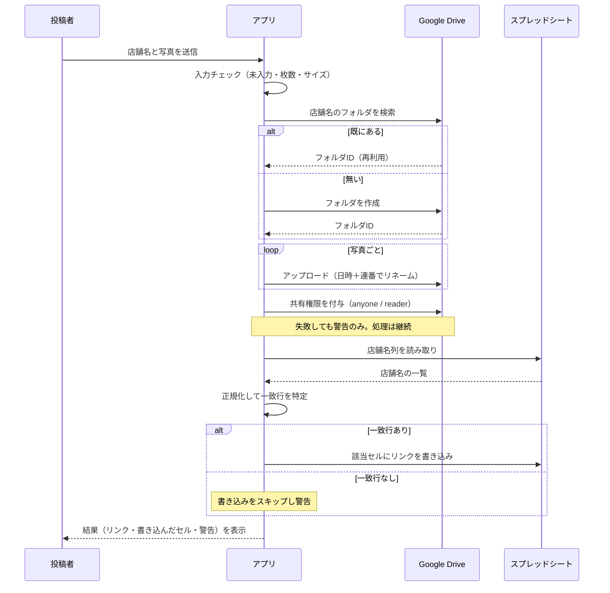

# システム設計書 — 店舗写真アップロードフォーム

| 項目 | 内容 |
| --- | --- |
| 版 | 1.0 |
| 作成日 | 2026-09-03 |
| 対応する要件定義 | [`要件定義.md`](要件定義.md) |

---

## 1. システム構成

社内の PC 1 台をローカルサーバとし、同じ LAN 内の端末からブラウザでアクセスする。
データの保存先は Google Drive と Google スプレッドシートで、サーバ機にはデータを持たない。



### 1.1 構成要素

| 要素 | 内容 |
| --- | --- |
| サーバ機 | Windows PC。Python 3.11 と Streamlit を導入し、`start.bat` で起動する |
| Web UI | Streamlit が生成する画面。投稿者は専用アプリを入れる必要がない |
| 認証 | Google サービスアカウント。投稿者個人の Google アカウントは不要 |
| 保存領域 | Google Drive（共有ドライブを推奨） |
| 台帳 | Google スプレッドシート。店舗マスタも兼ねる |

### 1.2 サーバ機にデータを置かない理由

サーバ機はあくまで **Google への中継役** に徹する。写真もリンクも Drive とシートに
置かれるため、サーバ機が故障・交換されてもデータは失われず、バックアップ運用も不要になる。

---

## 2. ネットワーク設計

| 項目 | 設定 |
| --- | --- |
| 待ち受けアドレス | `0.0.0.0`（LAN 内の全インタフェース） |
| ポート | TCP 8501 |
| プロトコル | HTTP（LAN 内限定のため平文を許容 / CON-06） |
| アクセス URL | サーバ機: `http://localhost:8501` / 他端末: `http://<サーバ機のIP>:8501` |
| ファイアウォール | Windows Defender ファイアウォールで TCP 8501 の受信を許可 |
| 外向き通信 | `www.googleapis.com` 等への HTTPS（443）が通ること |

### 2.1 IP アドレスの固定

投稿者に案内する URL を変えないため、サーバ機の IP アドレスは固定する。
ルータ側の **DHCP 予約**（MAC アドレスに対する固定割り当て）を推奨する。
サーバ機側で静的 IP を設定する方法でもよい。

### 2.2 インターネットに公開しない

ルータのポートフォワーディングは設定しない。認証が無い状態（NFR-06、8 章）で
外部からアクセスできると、第三者が任意の写真を Drive に書き込めてしまう。

---

## 3. ソフトウェア構成

### 3.1 モジュール構成

```
apps/store_photo_uploader/
├── app.py                       画面と投稿フローの制御
├── config.py                    設定の読み込み
├── google_services.py           認証と API クライアントの生成
├── drive_uploader.py            Drive 操作
├── sheet_writer.py              シートの照合と書き込み
├── start.bat                    ローカルサーバとして起動
├── requirements.txt             依存パッケージ
├── .streamlit/
│   ├── config.toml              Streamlit 設定（アップロード上限等）
│   └── secrets.toml             認証情報・接続先（Git 管理外）
├── docs/                        本書と要件定義書
└── tests/                       単体テスト
```

### 3.2 モジュールの責務

| モジュール | 責務 | 依存 |
| --- | --- | --- |
| `app.py` | 画面描画、入力チェック、`submit()` による処理の組み立て、結果表示 | 下記すべて |
| `config.py` | 環境変数 → `secrets.toml` → 既定値の順で設定を解決し `AppConfig` を返す | なし（Streamlit は任意依存） |
| `google_services.py` | サービスアカウント資格情報の生成と Drive / Sheets クライアントの構築 | `google-auth`, `google-api-python-client` |
| `drive_uploader.py` | フォルダの検索・作成、ファイルのアップロード、共有権限の付与、リンク生成 | `google-api-python-client` |
| `sheet_writer.py` | 店舗名の正規化、一致行の検索、A1 記法の組み立て、セルの更新 | なし（クライアントは引数で受け取る） |

**設計方針**: Google API クライアントは各モジュールが自前で作らず、引数で受け取る。
これにより `drive_uploader` と `sheet_writer` は差し替え可能になり、API に接続せずテストできる（NFR-11）。

### 3.3 レイヤ構造



---

## 4. 処理フロー

### 4.1 画面表示時



店舗名の一覧は 5 分間キャッシュする（NFR-02）。投稿成功時にはキャッシュを破棄し、
店舗が追加された場合に次回の表示へ反映されるようにする。

シートの読み取りに失敗した場合も、店舗名を手入力できる形でフォームを表示する。
台帳が一時的に読めないことを理由に写真の受け取りを止めない、という方針である（FR-14 と同じ考え方）。

### 4.2 投稿時



### 4.3 処理順序の設計意図

**Drive への保存を先に、シートへの書き込みを後に行う。** この 2 つは同一トランザクションに
できないため、片方だけ成功する状態が起こりうる。そのとき、

- 写真だけ保存されている → 管理者がシートに手でリンクを貼れば回復できる
- シートにだけリンクがある → リンク先に写真が無く、投稿者に再送を依頼するしかない

前者のほうが回復しやすいため、**写真の保存を先に確定させる**。

---

## 5. データ設計

### 5.1 Google Drive のフォルダ構造

```
指定フォルダ（DRIVE_FOLDER_ID）
├── 大村本店/
│   ├── 20260903-141530_01_店頭.jpg
│   ├── 20260903-141530_02_店内.jpg
│   └── 20260910-093012_01_看板.jpg
├── 大村南店/
│   └── 20260903-150244_01_外観.jpg
└── ...
```

| 要素 | 規則 |
| --- | --- |
| サブフォルダ名 | 投稿された店舗名そのまま。同名があれば再利用する |
| ファイル名 | `YYYYMMDD-HHMMSS_連番2桁_元のファイル名`（日本時間） |
| タイムスタンプ | 投稿処理の開始時刻。同一投稿内の全ファイルで同じ値を使う |

**店舗フォルダを再利用する理由**: フォルダを使い回すことで、店舗ごとの共有リンクが
常に同じ URL になる。同じ店舗が再投稿してもスプレッドシートのセルの値は変わらず、
リンクの張り替えが不要になる。

### 5.2 スプレッドシートの構造

| 設定 | 意味 | 既定値 |
| --- | --- | --- |
| `SHEET_NAME` | 対象シート名 | `シート1` |
| `STORE_NAME_COLUMN` | 店舗名が入っている列 | `A` |
| `LINK_COLUMN` | 共有リンクを書き込む列 | `B` |
| `FIRST_DATA_ROW` | データが始まる行（ヘッダーの次） | `2` |

例（`STORE_NAME_COLUMN=A`, `LINK_COLUMN=D`, `FIRST_DATA_ROW=2`）:

| 行 | A（店舗名） | B | C | D（写真リンク） |
| --- | --- | --- | --- | --- |
| 1 | 店舗名 | 住所 | 電話 | 写真 |
| 2 | 大村本店 | … | … | `https://drive.google.com/drive/folders/xxx` |
| 3 | 大村南店 | … | … | |

書き込みは `USER_ENTERED` で行い、スプレッドシート側で自動的にリンクとして扱われるようにする。

### 5.3 店舗名の正規化

照合キーは以下の順で生成する（`sheet_writer.normalize_store_name`）。

1. Unicode NFKC 正規化 — 全角英数字・記号を半角に統一する
2. 空白文字をすべて除去 — 半角空白、全角空白、タブ等
3. `casefold()` — 英字の大文字小文字を無視する

これにより「`ＡＢＣ 店`」「`abc店`」「`ABC　店`」がすべて同じキーになる。

**あえて正規化しないもの**: 「株式会社」「(株)」等の法人格表記や旧字体は変換しない。
店舗名として意味のある差である可能性があり、機械的に落とすと別店舗を取り違える危険があるため。

### 5.4 設定項目

| 設定 | 必須 | 既定値 |
| --- | --- | --- |
| `DRIVE_FOLDER_ID` | ○ | — |
| `SPREADSHEET_ID` | ○ | — |
| `gcp_service_account`（鍵 JSON） | ○ | — |
| `SHEET_NAME` | | `シート1` |
| `STORE_NAME_COLUMN` | | `A` |
| `LINK_COLUMN` | | `B` |
| `FIRST_DATA_ROW` | | `2` |
| `LINK_TARGET` | | `folder` |
| `MAX_FILES` | | `10` |
| `MAX_FILE_MB` | | `20` |

解決順序は **環境変数 → `secrets.toml` → 既定値**。必須項目が欠けている場合は
フォームを表示せず、不足している項目名を挙げた設定案内画面を出す。

---

## 6. 外部インタフェース

### 6.1 利用する Google API

| API | 用途 | 主なメソッド |
| --- | --- | --- |
| Drive API v3 | フォルダ検索 | `files.list` |
| Drive API v3 | フォルダ作成 | `files.create`（`mimeType: application/vnd.google-apps.folder`） |
| Drive API v3 | ファイル保存 | `files.create`（`MediaIoBaseUpload`、レジューム対応） |
| Drive API v3 | 共有設定 | `permissions.create`（`role: reader`, `type: anyone`） |
| Sheets API v4 | 店舗名の読み取り | `spreadsheets.values.get` |
| Sheets API v4 | リンクの書き込み | `spreadsheets.values.update` |

### 6.2 権限スコープ

| スコープ | 用途 |
| --- | --- |
| `https://www.googleapis.com/auth/drive` | フォルダ作成、アップロード、共有設定 |
| `https://www.googleapis.com/auth/spreadsheets` | シートの読み書き |

### 6.3 共有ドライブ対応

Drive API の全リクエストに `supportsAllDrives=True`、検索には
`includeItemsFromAllDrives=True` を付与する。これにより、保存先がマイドライブでも
共有ドライブでも同じコードで動作する。

**共有ドライブを推奨する理由**: マイドライブに保存するとファイルの所有者が
サービスアカウントになり、サービスアカウント自身の保存容量を消費する（CON-03）。
また、人間のメンバーからファイルが見えにくくなる。共有ドライブなら容量は組織側で
管理され、メンバーが通常どおり閲覧できる。

### 6.4 検索クエリのエスケープ

Drive の検索クエリは文字列連結で組み立てるため、フォルダ名に含まれる
シングルクォートとバックスラッシュをエスケープする（`_escape_query_value`）。
店舗名は利用者の入力値であり、エスケープを怠るとクエリが壊れる。

同様に、スプレッドシートの A1 記法ではシート名を `'` で囲み、
シート名中のシングルクォートを重ねてエスケープする（`quote_sheet_name`）。

---

## 7. エラー処理設計

| 事象 | 挙動 | 設計意図 |
| --- | --- | --- |
| 必須設定が未設定 | フォームを表示せず、不足項目を挙げた案内を出す | 動かない状態で投稿させない |
| 店舗名の一覧が読めない | 警告を出し、手入力できる形でフォームを表示 | 台帳が読めなくても写真は受け取る |
| 店舗名・写真が未入力 | 送信前にエラー表示、送信しない | 無駄な API 呼び出しを避ける |
| 枚数・サイズ超過 | 送信前にエラー表示、送信しない | 同上 |
| 共有権限の付与に失敗 | 警告を出し、保存と書き込みは続行 | 組織のポリシーで外部共有が禁止されている場合がある（CON-05） |
| 一致行が見つからない | 警告を出し、書き込みのみスキップ | 写真の保存を優先する（4.3） |
| 一致行が複数 | 全行に書き込み、対象行を表示 | どれか 1 行を勝手に選ぶより、実態を見せる |
| アップロード自体の失敗 | エラー内容を画面に表示 | 投稿者が再試行できるようにする |

### 7.1 例外の扱い

例外を握りつぶすのは、**握りつぶしても処理の目的が達成される場合に限る**。
共有権限の付与失敗（写真は保存済み）と店舗一覧の読み取り失敗（手入力で代替可能）が
これに当たる。いずれも画面に警告として必ず表示し、黙って握りつぶすことはしない。

---

## 8. セキュリティ設計

| 観点 | 方針 |
| --- | --- |
| ネットワーク | LAN 内限定。インターネットに公開しない（NFR-06） |
| 認証 | 初版では設けない。LAN への接続自体を境界とみなす |
| 資格情報の保管 | `secrets.toml` に置き、`.gitignore` で Git 管理から除外する（NFR-07） |
| 権限の最小化 | サービスアカウントは対象フォルダとシートにのみ共有する（NFR-08） |
| 入力値の扱い | 店舗名は Drive クエリと A1 記法に渡る前にエスケープする（6.4） |
| ファイル形式 | 拡張子を画像形式に限定する |
| 共有リンクの性質 | 「リンクを知っている全員が閲覧可」であり、リンクが漏れれば第三者が閲覧できる。機微な写真を扱わない前提とする（NFR-09） |

### 8.1 認証を設けないことの許容範囲

投稿者を絞る仕組みが無いため、**LAN に接続できる者は誰でも投稿できる**。
社内 LAN であること、投稿内容が店舗写真であること、投稿が Drive に記録され
後から確認できることから、初版では許容する。

来客用 Wi-Fi と社内 LAN が分離されていない環境や、投稿者を限定したい場合は、
合言葉の入力を必須にする簡易認証の追加を検討する（要件定義 8 章）。

---

## 9. 運用設計

### 9.1 日常の運用

| 作業 | 手順 |
| --- | --- |
| 起動 | サーバ機で `start.bat` をダブルクリック。表示された IP アドレスを投稿者に案内する |
| 停止 | 起動したウィンドウで `Ctrl + C` |
| 店舗の追加 | スプレッドシートに行を追加する。アプリ側の作業は不要（最大 5 分でフォームに反映） |
| 保存先の変更 | `secrets.toml` の `DRIVE_FOLDER_ID` を変更し、アプリを再起動する |

### 9.2 サーバ機の前提

| 項目 | 設定 |
| --- | --- |
| IP アドレス | DHCP 予約または静的 IP で固定（2.1） |
| スリープ | 利用時間帯はスリープしない設定にする |
| ファイアウォール | TCP 8501 の受信を許可 |

### 9.3 バックアップ

写真もリンクも Google 側にあるため、サーバ機のバックアップは不要である。
サーバ機が故障した場合は、別の PC に Python と本アプリを入れ、`secrets.toml` を
再作成すれば復旧できる。

### 9.4 障害時の切り分け

| 症状 | 確認順序 |
| --- | --- |
| 投稿者の端末から開けない | ① サーバ機でアプリが動いているか ② IP アドレスが変わっていないか ③ ファイアウォール ④ 同じ LAN に繋がっているか |
| 設定案内画面が出る | `secrets.toml` の必須項目 |
| 保存に失敗する | サービスアカウントがフォルダに編集者で共有されているか、サーバ機からインターネットに出られるか |
| シートに書かれない | 店舗名がシートに存在するか、`SHEET_NAME` と `STORE_NAME_COLUMN` の設定が実際のシートと合っているか |

---

## 10. テスト設計

Google API に接続せずに検証できる範囲を最大化する方針を採る（NFR-11）。

### 10.1 単体テスト

| 対象 | 観点 |
| --- | --- |
| `normalize_store_name` | 全角／半角、空白、大文字小文字の吸収。`None`・空文字の扱い |
| `find_matching_rows` | 一致行の行番号（`FIRST_DATA_ROW` を起点とした絶対行）、重複時の全件返却、空クエリの除外 |
| `quote_sheet_name` | シート名中のシングルクォートのエスケープ |

### 10.2 フローテスト

Drive / Sheets クライアントを模したスタブを `submit()` に渡し、API に接続せず
投稿フロー全体を検証する。

| 観点 |
| --- |
| アップロード、共有付与、フォルダリンクの書き込みが正しい順で行われること |
| 既存の店舗フォルダが再利用され、重複作成されないこと |
| `LINK_TARGET=file` で単一ファイルのリンクが使われること |
| `LINK_TARGET=file` でも複数枚ならフォルダリンクに切り替わること |
| 一致行が無い場合、保存は成功し書き込みのみスキップされること |
| 一致行が複数ある場合、全行に書き込まれること |
| 共有付与に失敗しても、警告を出したうえで書き込みが行われること |

### 10.3 結合テスト（手動）

実際の Google アカウントを用い、要件定義 9 章の受入基準を確認する。
初回は本番の Drive フォルダ・スプレッドシートではなく、**テスト用のフォルダとシート** で行う。

### 10.4 継続的インテグレーション

GitHub Actions で、`apps/store_photo_uploader/tests` を push / pull request ごとに実行する。

---

## 11. 実装状況

| 項目 | 状況 |
| --- | --- |
| 本設計に沿った実装 | 完了（`apps/store_photo_uploader/`） |
| 単体テスト・フローテスト | 実装済み・全件パス |
| CI | 追加済み |
| 実際の Google API との疎通 | **未実施**。資格情報の準備後に 10.3 の結合テストが必要 |
